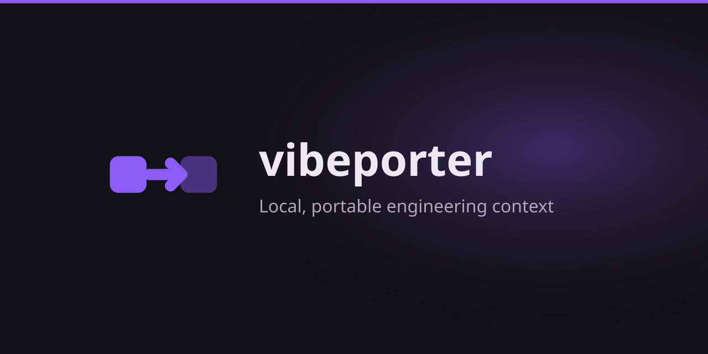

<p align="center">
  
</p>

# Vibeporter

Local context handoff for AI coding agents. Select useful context from a long chat for a new native session in another agent while retaining the task, decisions, current status, and next steps.

[](https://vibeporter.pages.dev)
[](#)

## Features

- Creates budgeted context handoffs locally; no cloud, accounts, telemetry, or background service.
- Converts chat histories from JSONL or SQLite into a standard format.
- Supports Claude Code, OpenCode, Gemini CLI, Antigravity, Kimi Code, DeepSeek Harness, and Cursor (read and write).
- Copies configuration files (e.g., `CLAUDE.md` to `GEMINI.md`).

## Quick Start

### Installation

```bash
curl -fsSL https://vibeporter.pages.dev/install.sh | sh
```

Windows:

```powershell
Invoke-Expression (Invoke-WebRequest -Uri "https://vibeporter.pages.dev/install.ps1" -UseBasicParsing).Content
```

Alternative (downloads the same GitHub Release binary on first run):

```bash
npx vibeporter@latest list claudecode
```

### Usage

```bash
vibeporter list claudecode

vibeporter handoff --from claudecode --source <chat-id-from-list> \
  --to opencode --compact 200k

vibeporter handoff --from cursor --source /path/to/chat --to gemini \
  --compact 100k --strategy recent --dry-run

vibeporter serve

vibeporter search "fix database bug" --agent gemini
vibeporter stats --json | jq

vibeporter port-config --from claudecode --to gemini --dir .
```

## Documentation

[https://vibeporter.pages.dev](https://vibeporter.pages.dev)

## License

MIT
