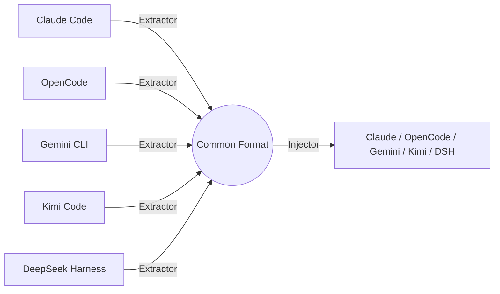

# Overview

Vibeporter is a CLI tool that migrates chat histories and workspace configurations between AI coding agents. Switched editors? Trying a new agent? Take your conversations with you — no vendor lock-in.

## Why Vibeporter?

- **No lock-in:** Your conversations belong to you. Move them between agents freely.
- **Single binary:** Compiled Go with zero runtime dependencies. Pure Go SQLite (no CGO), so it cross-compiles anywhere.
- **One common format:** Every agent is described by a small adapter that reads into — and writes out of — a shared intermediate representation. Adding a new agent is just one adapter, not N×N converters.
- **Agent-friendly:** Designed to be invoked by AI agents themselves, not just humans.

## How it works

Vibeporter never converts one agent's format directly into another's. Instead, each agent has an **extractor** (reads its native format) and an **injector** (writes it). Both sides speak a common intermediate representation (IR), so any source can reach any target through one hop.

Extract and inject both exist for Claude Code, OpenCode, Gemini CLI, Kimi Code, and DeepSeek Harness. Inject always creates a **new** session and never overwrites one that already exists. `migrate` writes into the target's native store when `--target` is omitted.
