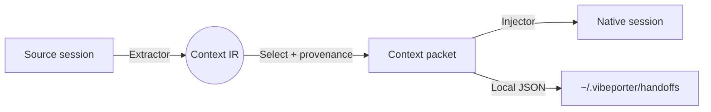

# Overview

Vibeporter preserves engineering context locally and makes it portable across AI agents, developers, teams, and projects.

It runs as a local CLI and a local web UI. The unit of transfer is a **context packet**. Adapters, `handoff`, `export`, and `port-config` are how packets and project files move — not the definition of the product.

## Why Vibeporter?

- **Context, not lock-in:** Working memory should survive a tool switch. Source sessions stay yours; packets carry a budgeted slice with provenance.
- **Local only:** No cloud service, account, telemetry, or daemon. Data stays on the device that runs the binary.
- **Single binary:** Compiled Go with no runtime dependencies. Pure Go SQLite (no CGO).
- **One common format:** Each agent has an extractor and an injector around a shared intermediate representation (IR). Adding an agent is one adapter, not N×N converters.
- **Agent-friendly:** Designed to be invoked by coding agents as well as humans.

## How it works

Vibeporter never converts one agent's format directly into another's. Extractors read native stores into the IR. Injectors write the IR back. `handoff` sits on that path: it selects context to a token budget, wraps it as a context packet, and writes a **new** target session.

The IR is a list of messages. Each message has a role (`user`, `assistant`, `system`) and **parts**: text, thinking, tool_call, tool_result. `Content` is a plain-text fallback. Images, attachments, and subagent transcripts are not mapped.

Extract and inject both exist for Claude Code, OpenCode, Gemini CLI, Kimi Code, DeepSeek Harness, and Cursor. Un-compacted session copy still uses the `migrate` command name for compatibility. See [Context model](/context) and [Integrations](/integrations).

## What this is not

- Not a hosted team workspace (that is [planned](/teams)).
- Not a generic vector database or a Notion replacement.
- Not a claim of multi-user access control: the current product is single-machine.
