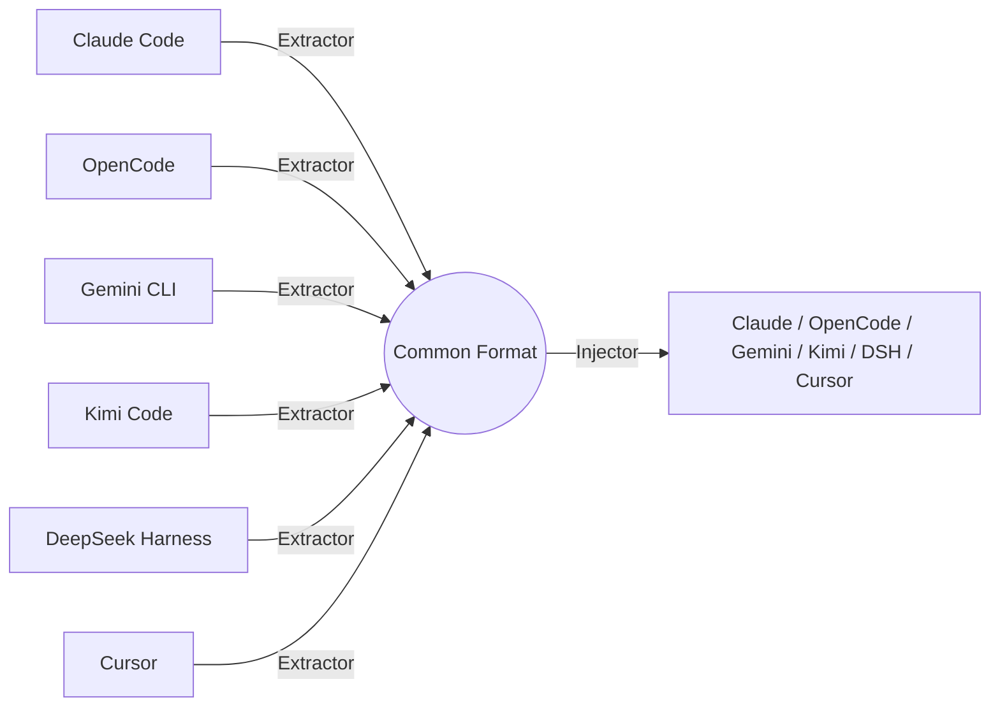

# Overview

Vibeporter is a local CLI for handing off AI chat context into a fresh native session in another coding agent. Select a useful context budget for a long chat, preserve task intent and recent progress, and avoid vendor lock-in.

## Why Vibeporter?

- **No lock-in:** Your conversations belong to you. Move them between agents freely.
- **Local only:** Chat data remains on your device; Vibeporter has no cloud service, account, telemetry, or daemon.
- **Single binary:** Compiled Go with zero runtime dependencies. Pure Go SQLite (no CGO), so it cross-compiles anywhere.
- **One common format:** Every agent is described by a small adapter that reads into — and writes out of — a shared intermediate representation. Adding a new agent is just one adapter, not N×N converters.
- **Agent-friendly:** Designed to be invoked by AI agents themselves, not just humans.

## How it works

Vibeporter never converts one agent's format directly into another's. Instead, each agent has an **extractor** (reads its native format) and an **injector** (writes it). Both sides speak a common intermediate representation (IR), so any source can reach any target through one hop.

The IR is a list of messages. Each message has a role (`user`, `assistant`, `system`) and **parts**: text, thinking, tool_call, tool_result. `Content` is a plain-text fallback (titles and list previews skip thinking). System prompts round-trip when the native format has a slot for them. Images, attachments, and subagent transcripts are not mapped.

Extract and inject both exist for Claude Code, OpenCode, Gemini CLI, Kimi Code, DeepSeek Harness, and Cursor. `handoff` uses this same pipeline after local context selection, and inject always creates a **new** session without overwriting the source. `migrate` remains available for raw, un-compacted transfers.
